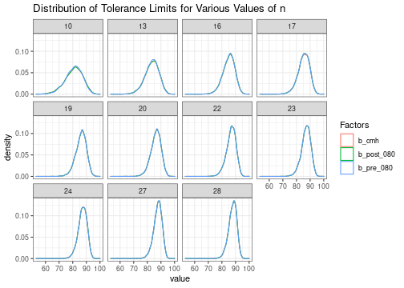
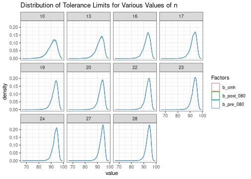

In this vignette, we'll use the following packages:


```r
library(dplyr)
library(ggplot2)
library(purrr)
library(tidyr)
```


The Extended Hanson--Koopmans method is a nonparametric method of
determining tolerance limits (such as A- or B-Basis values).
This method does not assume
any particular distribution, but does require that
$-\log\left(F\right)$ is convex, where $F$ is the cumulative distribution
function (CDF) of the distribution.

The functions `kh_ext_z`, `hk_ext_z_j_opt` and `basis_kh_ext` in `cmstatr`
are based on the Extended Hanson--Koopmans method, developed by
Vangel [@Vangel1994]. This is an extension of the method published in
[@Hanson1964].

Tolerance limits (Basis values) calculated using the Extended
Hanson--Koopmans method are calculated based on two order statistics [^1], $i$
and $j$, and a factor, $z$.
The function `hk_ext_z_j_opt` and the function
`basis_kh_ext` (with `method = "optimum-order"`) set the first of
these order statistics to the first (lowest) order statistic,
and a second order statistic determined by minimizing the following
function:

$$
\left| z E\left(X_{\left(1\right)}\right)
+ \left(1 - z\right) E\left(X_{\left(j\right)}\right)
- \Phi\left(p\right)\right|
$$

Where $E\left(X_{(i)}\right)$ is the expected value of the
$i\,\mathrm{th}$ order
statistic for a sample drawn from the standard normal distribution,
and $\Phi\left(p\right)$
is the CDF of a standard normal distribution for the content of the tolerance
limit (i.e. $p=0.9$ for B-Basis).

[^1]: The $i\,\mathrm{th}$ order statistic is the $i\,\mathrm{th}$
lowest value in the sample.

The value of $z$ is calculated based on the sample size, $n$, the two order
statistics $i$ and $j$, the content $p$ and the confidence. The calculation
is performed using the method in [@Vangel1994] and
implemented in `kh_ext_z`. The value of $j$ is very sensitive to the way that
the expected value of the order statistics is calculated, and may be sensitive
to numerical precision.

In version 0.8.0 of `cmstatr` and prior, the expected value of an order
statistic for a sample drawn from a standard normal distribution was
determined in a crude way. After version 0.8.0, the method in
[@Harter1961] is used. These method produce different values of $j$ for certain
sample sizes. Additionally, a table of $j$ and $z$ values for various
sample sizes is published in CMH-17-1G[^2] [@CMH-17-1G].
This table gives slightly different
values of $j$ for some sample sizes.

[^2]: Note that CMH-17-1G uses the symbols $r$ and $k$ instead of
      $j$ and $z$.

The values of $j$ and $z$ produced by `cmstatr` in version 0.8.0 and before,
the values produced after version 0.8.0 and the value published in CMH-17-1G
are shown below. All of these values are for B-Basis (90% content,
95% confidence).


```r
factors <- tribble(
  ~n, ~j_pre_080, ~z_pre_080, ~j_post_080, ~z_post_080, ~j_cmh, ~z_cmh,
  2, 2, 35.1768141883907, 2, 35.1768141883907, 2, 35.177,
  3, 3, 7.85866787768029, 3, 7.85866787768029, 3, 7.859,
  4, 4, 4.50522447199018, 4, 4.50522447199018, 4, 4.505,
  5, 4, 4.10074820079326, 4, 4.10074820079326, 4, 4.101,
  6, 5, 3.06444416024793, 5, 3.06444416024793, 5, 3.064,
  7, 5, 2.85751000593839, 5, 2.85751000593839, 5, 2.858,
  8, 6, 2.38240998122575, 6, 2.38240998122575, 6, 2.382,
  9, 6, 2.25292053841772, 6, 2.25292053841772, 6, 2.253,
  10, 7, 1.98762060673102, 6, 2.13665759924781, 6, 2.137,
  11, 7, 1.89699586212496, 7, 1.89699586212496, 7, 1.897,
  12, 7, 1.81410756892749, 7, 1.81410756892749, 7, 1.814,
  13, 8, 1.66223343216608, 7, 1.73773765993598, 7, 1.738,
  14, 8, 1.59916281901889, 8, 1.59916281901889, 8, 1.599,
  15, 8, 1.54040000806181, 8, 1.54040000806181, 8, 1.54,
  16, 9, 1.44512878109546, 8, 1.48539432060546, 8, 1.485,
  17, 9, 1.39799975474842, 9, 1.39799975474842, 8, 1.434,
  18, 9, 1.35353033609361, 9, 1.35353033609361, 9, 1.354,
  19, 10, 1.28991705486727, 9, 1.31146980117942, 9, 1.311,
  20, 10, 1.25290765871981, 9, 1.27163203813793, 10, 1.253,
  21, 10, 1.21771654027026, 10, 1.21771654027026, 10, 1.218,
  22, 11, 1.17330587650406, 10, 1.18418267046374, 10, 1.184,
  23, 11, 1.14324511741536, 10, 1.15218647199938, 11, 1.143,
  24, 11, 1.11442082880151, 10, 1.12153586685854, 11, 1.114,
  25, 11, 1.08682185727661, 11, 1.08682185727661, 11, 1.087,
  26, 11, 1.06032912052507, 11, 1.06032912052507, 11, 1.06,
  27, 12, 1.03307994274081, 11, 1.03485308510789, 11, 1.035,
  28, 12, 1.00982188136729, 11, 1.01034609051393, 12, 1.01
)
```

For the sample sizes where $j$ is the same for each approach, the values
of $z$ are also equal within a small tolerance.


```r
factors %>%
  filter(j_pre_080 == j_post_080 & j_pre_080 == j_cmh)
#> # A tibble: 16 x 7
#>        n j_pre_080 z_pre_080 j_post_080 z_post_080 j_cmh z_cmh
#>    <dbl>     <dbl>     <dbl>      <dbl>      <dbl> <dbl> <dbl>
#>  1     2         2     35.2           2      35.2      2 35.2 
#>  2     3         3      7.86          3       7.86     3  7.86
#>  3     4         4      4.51          4       4.51     4  4.50
#>  4     5         4      4.10          4       4.10     4  4.10
#>  5     6         5      3.06          5       3.06     5  3.06
#>  6     7         5      2.86          5       2.86     5  2.86
#>  7     8         6      2.38          6       2.38     6  2.38
#>  8     9         6      2.25          6       2.25     6  2.25
#>  9    11         7      1.90          7       1.90     7  1.90
#> 10    12         7      1.81          7       1.81     7  1.81
#> 11    14         8      1.60          8       1.60     8  1.60
#> 12    15         8      1.54          8       1.54     8  1.54
#> 13    18         9      1.35          9       1.35     9  1.35
#> 14    21        10      1.22         10       1.22    10  1.22
#> 15    25        11      1.09         11       1.09    11  1.09
#> 16    26        11      1.06         11       1.06    11  1.06
```

The sample sizes where the value of $j$ differs are as follows:


```r
factor_diff <- factors %>%
  filter(j_pre_080 != j_post_080 | j_pre_080 != j_cmh | j_post_080 != j_cmh)
factor_diff
#> # A tibble: 11 x 7
#>        n j_pre_080 z_pre_080 j_post_080 z_post_080 j_cmh z_cmh
#>    <dbl>     <dbl>     <dbl>      <dbl>      <dbl> <dbl> <dbl>
#>  1    10         7      1.99          6       2.14     6  2.14
#>  2    13         8      1.66          7       1.74     7  1.74
#>  3    16         9      1.45          8       1.49     8  1.48
#>  4    17         9      1.40          9       1.40     8  1.43
#>  5    19        10      1.29          9       1.31     9  1.31
#>  6    20        10      1.25          9       1.27    10  1.25
#>  7    22        11      1.17         10       1.18    10  1.18
#>  8    23        11      1.14         10       1.15    11  1.14
#>  9    24        11      1.11         10       1.12    11  1.11
#> 10    27        12      1.03         11       1.03    11  1.03
#> 11    28        12      1.01         11       1.01    12  1.01
```

While there are differences in the three implementations, it's not clear
how much these differences will matter in terms of the tolerance limits
calculated. This can be investigated through simulation.

# Simulation with Normally Distributed Data
First, we'll generate a large number (10,000) of samples of sample size
$n$ from a normal distribution. Since we're generating the samples, we
know the true population parameters, so can calculate the true population
quantiles. We'll use the three sets of $j$ and $z$ values to compute
tolerance limits and compared those tolerance limits to the population
quantiles. The proportion of the calculated tolerance limits below the
population quantiles should be equal to the selected confidence. We'll
restrict the simulation study to the sample sizes where the values of
$j$ and $z$ differ in the three implementations of this method, and we'll
consider B-Basis (90% content, 95% confidence).


```r
mu_normal <- 100
sd_normal <- 6

set.seed(1234567)  # make this reproducible

tolerance_limit <- function(x, j, z) {
  x[j] * (x[1] / x[j]) ^ z
}

sim_normal <- pmap_dfr(factor_diff, function(n, j_pre_080, z_pre_080,
                                             j_post_080, z_post_080,
                                             j_cmh, z_cmh) {
  map_dfr(1:10000, function(i_sim) {
    x <- sort(rnorm(n, mu_normal, sd_normal))
    tibble(
      n = n,
      b_pre_080 = tolerance_limit(x, j_pre_080, z_pre_080),
      b_post_080 = tolerance_limit(x, j_post_080, z_post_080),
      b_cmh = tolerance_limit(x, j_cmh, z_cmh),
      x = list(x)
    )
  }
  )
})
sim_normal
#> # A tibble: 110,000 x 5
#>        n b_pre_080 b_post_080 b_cmh x         
#>    <dbl>     <dbl>      <dbl> <dbl> <list>    
#>  1    10      78.4       77.7  77.7 <dbl [10]>
#>  2    10      82.8       82.0  82.0 <dbl [10]>
#>  3    10      83.3       83.0  83.0 <dbl [10]>
#>  4    10      78.4       77.2  77.2 <dbl [10]>
#>  5    10      87.3       86.6  86.6 <dbl [10]>
#>  6    10      92.3       93.2  93.2 <dbl [10]>
#>  7    10      75.2       77.9  77.9 <dbl [10]>
#>  8    10      75.4       73.9  73.9 <dbl [10]>
#>  9    10      75.5       75.1  75.1 <dbl [10]>
#> 10    10      76.4       78.4  78.4 <dbl [10]>
#> # … with 109,990 more rows
```

One can see that the tolerance limits calculated with each set of
factors for (most) data sets is different. However, this does not necessarily
mean that any set of factors is more or less correct.

The distribution of the tolerance limits for each sample size is as follows:


```r
sim_normal %>%
  pivot_longer(cols = b_pre_080:b_cmh, names_to = "Factors") %>%
  ggplot(aes(x = value, color = Factors)) +
  geom_density() +
  facet_wrap(n ~ .) +
  theme_bw() +
  ggtitle("Distribution of Tolerance Limits for Various Values of n")
```



For all samples sizes, the distribution of tolerance limits is actually
very similar between all three sets of factors.

The true population quantile can be calculated as follows:


```r
x_p_normal <- qnorm(0.9, mu_normal, sd_normal, lower.tail = FALSE)
x_p_normal
#> [1] 92.31069
```

The proportion of calculated tolerance limit values that are below the
population quantile can be calculated as follows. We see that the in all
cases the tolerance limits are all conservative, and also that each
set of factors produce similar levels of conservatism.


```r
sim_normal %>%
  mutate(below_pre_080 = b_pre_080 < x_p_normal,
         below_post_080 = b_post_080 < x_p_normal,
         below_cmh = b_cmh < x_p_normal) %>%
  group_by(n) %>%
  summarise(
    prop_below_pre_080 = sum(below_pre_080) / n(),
    prop_below_post_080 = sum(below_post_080) / n(),
    prop_below_cmh = sum(below_cmh) / n()
  )
#> # A tibble: 11 x 4
#>        n prop_below_pre_080 prop_below_post_080 prop_below_cmh
#>    <dbl>              <dbl>               <dbl>          <dbl>
#>  1    10              0.984               0.980          0.980
#>  2    13              0.979               0.975          0.975
#>  3    16              0.969               0.967          0.967
#>  4    17              0.973               0.973          0.971
#>  5    19              0.962               0.961          0.961
#>  6    20              0.964               0.962          0.964
#>  7    22              0.961               0.960          0.960
#>  8    23              0.960               0.959          0.960
#>  9    24              0.962               0.961          0.962
#> 10    27              0.954               0.953          0.954
#> 11    28              0.952               0.952          0.952
```

# Simulation with Weibull Data

Next, we'll do a similar simulation using data drawn from a Weibull
distribution. Again, we'll generate 10,000 samples for each sample size.


```r
shape_weibull <- 60
scale_weibull <- 100

set.seed(234568)  # make this reproducible

sim_weibull <- pmap_dfr(factor_diff, function(n, j_pre_080, z_pre_080,
                                              j_post_080, z_post_080,
                                              j_cmh, z_cmh) {
  map_dfr(1:10000, function(i_sim) {
    x <- sort(rweibull(n, shape_weibull, scale_weibull))
    tibble(
      n = n,
      b_pre_080 = tolerance_limit(x, j_pre_080, z_pre_080),
      b_post_080 = tolerance_limit(x, j_post_080, z_post_080),
      b_cmh = tolerance_limit(x, j_cmh, z_cmh),
      x = list(x)
    )
  }
  )
})
sim_weibull
#> # A tibble: 110,000 x 5
#>        n b_pre_080 b_post_080 b_cmh x         
#>    <dbl>     <dbl>      <dbl> <dbl> <list>    
#>  1    10      95.3       95.1  95.1 <dbl [10]>
#>  2    10      88.5       88.3  88.3 <dbl [10]>
#>  3    10      89.7       89.3  89.3 <dbl [10]>
#>  4    10      94.7       94.4  94.4 <dbl [10]>
#>  5    10      96.9       96.9  96.9 <dbl [10]>
#>  6    10      93.6       93.2  93.2 <dbl [10]>
#>  7    10      86.1       85.5  85.5 <dbl [10]>
#>  8    10      91.9       91.9  91.9 <dbl [10]>
#>  9    10      93.7       93.4  93.4 <dbl [10]>
#> 10    10      90.9       90.4  90.4 <dbl [10]>
#> # … with 109,990 more rows
```


The distribution of the tolerance limits for each sample size is as follows.
Once again, we see that the distribution of tolerance limits is nearly
identical when each of the three sets of factors are used.


```r
sim_weibull %>%
  pivot_longer(cols = b_pre_080:b_cmh, names_to = "Factors") %>%
  ggplot(aes(x = value, color = Factors)) +
  geom_density() +
  facet_wrap(n ~ .) +
  theme_bw() +
  ggtitle("Distribution of Tolerance Limits for Various Values of n")
```



The true population quantile can be calculated as follows:


```r
x_p_weibull <- qweibull(0.9, shape_weibull, scale_weibull, lower.tail = FALSE)
x_p_weibull
#> [1] 96.31885
```

The proportion of calculated tolerance limit values that are below the
population quantile can be calculated as follows. We see that the in all
roughly 95% or more of the tolerance limits calculated for each sample
is below the population quantile. We also see very similar proportions
for each of the three sets of factors considered.


```r
sim_weibull %>%
  mutate(below_pre_080 = b_pre_080 < x_p_weibull,
         below_post_080 = b_post_080 < x_p_weibull,
         below_cmh = b_cmh < x_p_weibull) %>%
  group_by(n) %>%
  summarise(
    prop_below_pre_080 = sum(below_pre_080) / n(),
    prop_below_post_080 = sum(below_post_080) / n(),
    prop_below_cmh = sum(below_cmh) / n()
  )
#> # A tibble: 11 x 4
#>        n prop_below_pre_080 prop_below_post_080 prop_below_cmh
#>    <dbl>              <dbl>               <dbl>          <dbl>
#>  1    10              0.97                0.965          0.965
#>  2    13              0.966               0.964          0.964
#>  3    16              0.959               0.959          0.959
#>  4    17              0.961               0.961          0.96 
#>  5    19              0.957               0.956          0.956
#>  6    20              0.955               0.954          0.955
#>  7    22              0.953               0.952          0.952
#>  8    23              0.950               0.950          0.950
#>  9    24              0.953               0.953          0.953
#> 10    27              0.952               0.951          0.951
#> 11    28              0.950               0.950          0.950
```


# Conclusion
The values of $j$ and $z$ computed by the `kh_Ext_z_j_opt` function differs
for certain samples sizes ($n$) before and after version 0.8.0. Furthermore,
for certain sample sizes, these values differ from those published in
CMH-17-1G. The simulation study presented in this vignette shows that
the tolerance limit (Basis value) might differ for any individual sample
based on which set of $j$ and $z$ are used. However, each set of factors
produces tolerance limit factors that are either correct or conservative.
These three methods have very similar performance, and tolerance limits
produced with any of these three methods are equally valid.

# Session Info
This vignette is computed in advance. A system with the following configuration
was used:


```r
sessionInfo()
#> R version 4.1.0 (2021-05-18)
#> Platform: x86_64-pc-linux-gnu (64-bit)
#> Running under: Ubuntu 20.04.2 LTS
#> 
#> Matrix products: default
#> BLAS:   /usr/lib/x86_64-linux-gnu/blas/libblas.so.3.9.0
#> LAPACK: /usr/lib/x86_64-linux-gnu/lapack/liblapack.so.3.9.0
#> 
#> locale:
#>  [1] LC_CTYPE=en_CA.UTF-8       LC_NUMERIC=C               LC_TIME=en_CA.UTF-8        LC_COLLATE=en_CA.UTF-8    
#>  [5] LC_MONETARY=en_CA.UTF-8    LC_MESSAGES=en_CA.UTF-8    LC_PAPER=en_CA.UTF-8       LC_NAME=C                 
#>  [9] LC_ADDRESS=C               LC_TELEPHONE=C             LC_MEASUREMENT=en_CA.UTF-8 LC_IDENTIFICATION=C       
#> 
#> attached base packages:
#> [1] stats     graphics  grDevices utils     datasets  methods   base     
#> 
#> other attached packages:
#> [1] tidyr_1.1.3   purrr_0.3.4   ggplot2_3.3.3 dplyr_1.0.6  
#> 
#> loaded via a namespace (and not attached):
#>  [1] highr_0.9          pillar_1.6.1       compiler_4.1.0     kSamples_1.2-9     tools_4.1.0        digest_0.6.27     
#>  [7] testthat_3.0.2     pkgload_1.2.1      evaluate_0.14      lifecycle_1.0.0    tibble_3.1.2       gtable_0.3.0      
#> [13] pkgconfig_2.0.3    rlang_0.4.11       DBI_1.1.1          cli_2.5.0          rstudioapi_0.13    yaml_2.2.1        
#> [19] xfun_0.23          cmstatr_0.8.0.9000 withr_2.4.2        stringr_1.4.0      knitr_1.33         SuppDists_1.1-9.5 
#> [25] generics_0.1.0     desc_1.3.0         vctrs_0.3.8        rprojroot_2.0.2    grid_4.1.0         tidyselect_1.1.1  
#> [31] glue_1.4.2         R6_2.5.0           fansi_0.5.0        rmarkdown_2.8      farver_2.1.0       magrittr_2.0.1    
#> [37] htmltools_0.5.1.1  MASS_7.3-54        scales_1.1.1       ellipsis_0.3.2     assertthat_0.2.1   colorspace_2.0-1  
#> [43] labeling_0.4.2     utf8_1.2.1         stringi_1.6.2      munsell_0.5.0      crayon_1.4.1
```


# References
